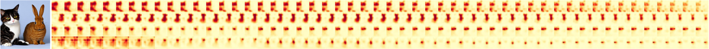

## InitNO: Boosting Text-to-Image Diffusion Models via Initial Noise Optimization<br><sub>Official PyTorch code release for the CVPR 2024 paper: https://arxiv.org/abs/2404.04650</sub>


**InitNO: Boosting Text-to-Image Diffusion Models via Initial Noise Optimization**<br>
Xiefan Guo, Jinlin Liu, Miaomiao Cui, Jiankai Li, Hongyu Yang, Di Huang<br>
https://xiefan-guo.github.io/initno<br>

Abstract: *Our investigation dives into the exploration of various random noise configurations and their subsequent influence on the generated results. Notably, when different noises are input into SD under identical text prompts, there are marked discrepancy in the alignment between the generated image and the given text. Unsuccessful cases are delineated by gray contours, while successful instances are indicated by yellow contours. This observation underscores the pivotal role of initial noise in determining the success of the generation process. Based on this insight, we divide the initial noise space into valid and invalid regions. Introducing Initial Noise Optimization (InitNO), identified as orange arrow, our method is capable of guiding any initial noise into the valid region, thereby synthesizing high-fidelity results (orange contours) that precisely correspond to the given prompt. The same location employs the same random seed.*

## Requirements

* Linux and Windows are supported, but we recommend Linux for performance and compatibility reasons.
* All experiments are conducted on a single NVIDIA V100 GPU (32 GB).

## Getting started

**Python libraries:** See environment.yml for exact library dependencies. You can use the following commands to create and activate your InitNO Python environment:

```.bash
# Create conda environment
conda env create -f environment.yaml
# Activate conda environment
conda activate initno_env
```

**Hugging face fiffusers library:** Our code relies also on Hugging Face's [diffusers](https://github.com/huggingface/diffusers) library for downloading the Stable Diffusion model.

**Generating images:** Run the following command to generate images.
```.bash
python run_sd_initno.py
```

You can specify the following arguments in `run_sd_initno.py`:

* `SEEDS`: a list of random seeds
* `PROMPT`: text prompt for image generation
* `token_indices`: a list of target token indices
* `result_root`: path to save generated results

**Visualization of attention maps:** We provide the `fn_show_attention` function in `attn_utils.py` for attention map visualization. By running the above command, you will be able to obtain the following visualization of attention maps along with the generated images.



**Float16 precision:** You can use `torch.float16` when loading the stable diffusion model to speed up inference and reduce memory usage. However, this may somewhat degrade the quality of the generated results.
```.bash
pipe = StableDiffusionInitNOPipeline.from_pretrained(SD14_VERSION, torch_dtype=torch.float16).to("cuda")
```

## Citation

```bibtex
@inproceedings{guo2024initno,
    title     = {InitNO: Boosting Text-to-Image Diffusion Models via Initial Noise Optimization},
    author    = {Guo, Xiefan and Liu, Jinlin and Cui, Miaomiao and Li, Jiankai and Yang, Hongyu and Huang, Di},
    booktitle = {CVPR},
    year      = {2024}
}
```

## Acknowledgments

The code is built upon [diffusers](https://github.com/huggingface/diffusers) and [Attend-and-Excite](https://github.com/yuval-alaluf/Attend-and-Excite), we thank all the contributors for open-sourcing.