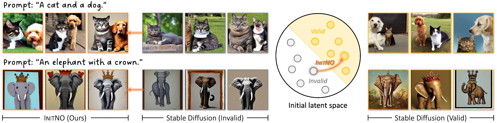

# InitNO: Boosting Text-to-Image Diffusion Models via Initial Noise Optimization

This repository contains the official PyTorch implementation of the following paper:
> **InitNO: Boosting Text-to-Image Diffusion Models via Initial Noise Optimization** 
Xiefan Guo, Jinlin Liu, Miaomiao Cui, Jiankai Li, Hongyu Yang, Di Huang 
_IEEE/CVF International Conference on Computer Vision (CVPR), 2024_

## Overview

**InitNO**. Our investigation dives into the exploration of various random noise configurations and their subsequent influence on the generated results. Notably, when different noises are input into SD under identical text prompts, there are marked discrepancy in the alignment between the generated image and the given text. Unsuccessful cases are delineated by gray contours, while successful instances are indicated by yellow contours. This observation underscores the pivotal role of initial noise in determining the success of the generation process. Based on this insight, we divide the initial noise space into valid and invalid regions. Introducing Initial Noise Optimization (InitNO), identified as orange arrow, our method is capable of guiding any initial noise into the valid region, thereby synthesizing highfidelity results (orange contours) that precisely correspond to the given prompt. The same location employs the same random seed.

Note: The code will be updated before the CVPR2024 conference(2024.6.17).